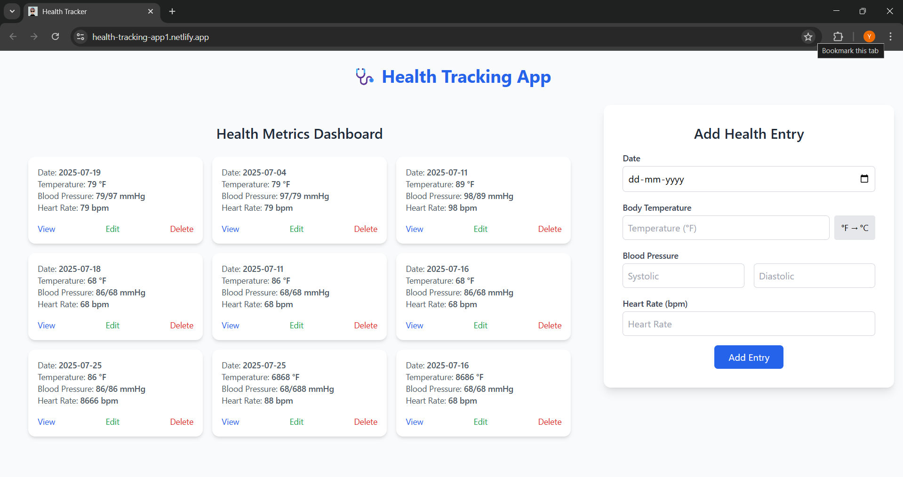

# 🩺 Health Tracking App

A fully functional MERN (MongoDB, Express, React, Node.js) stack application that allows users to track their daily health metrics including body temperature, blood pressure, and heart rate. Built with a clean, modern UI using Tailwind CSS and deployed on Netlify + Render.

> ✅ Stay healthy by tracking your vitals daily!

---

## 🌐 Live Demo

- 🔷 **Frontend**: [https://health-tracking-app1.netlify.app](https://health-tracking-app1.netlify.app)
- 🔶 **Backend API**: [https://health-tracking-app-1-qr14.onrender.com](https://health-tracking-app-1-qr14.onrender.com)

---

## 📸 Screenshot



---

## 🛠 Tech Stack

### 🔹 Frontend:
- React
- Tailwind CSS
- Axios

### 🔸 Backend:
- Node.js
- Express.js
- MongoDB with Mongoose
- Dotenv & CORS

### 🌐 Deployment:
- **Frontend**: Netlify
- **Backend**: Render

---

## 🚀 Features

- 🗓 **Add** health metrics:
  - Date
  - Temperature (with °C/°F toggle)
  - Blood Pressure (Systolic / Diastolic)
  - Heart Rate

- 📋 **Dashboard View** of all entries
- ✏️ **Edit** and 🗑️ **Delete** entries
- 🔍 **Filter by Date**
- 🧮 All data stored in MongoDB
- 🎨 Clean, minimal UI with modern design
- 📱 Fully responsive

---

## 📁 Project Structure

```

health-tracking-app/
├── client/              # React frontend
│   ├── src/
│   │   ├── components/
│   │   ├── App.js
│   │   └── index.js
│   ├── public/
│   ├── tailwind.config.js
│   └── .env
└── server/              # Node.js + Express backend
├── models/
├── routes/
├── controllers/
├── server.js
└── .env

````

---

## ⚙️ Local Setup

### 1️⃣ Clone the Repository


git clone https://github.com/YOUR_USERNAME/health-tracking-app.git
cd health-tracking-app


---

### 2️⃣ Backend Setup (Render-compatible)


cd server
npm install


Create `.env` in the `server/` directory:

PORT=5000
MONGO_URI=your_mongodb_connection_string


Then run:


npm start


---

### 3️⃣ Frontend Setup


cd client
npm install


Create `.env` in the `client/` directory:


REACT_APP_API_BASE_URL=http://localhost:5000


Then run the React app:


npm start


---

## 🧪 Deployment Guide

### 🔷 Frontend (Netlify)

* **Build command**: `npm run build`
* **Publish directory**: `build`
* **Environment variables**:

 
  REACT_APP_API_BASE_URL=https://health-tracking-app-1-qr14.onrender.com


### 🔶 Backend (Render)

* **Root directory**: `server`
* **Start command**: `node server.js`
* **Environment variables**:


  MONGO_URI=your_mongodb_uri


---

## 📄 API Endpoints

| Method | Route                | Description        |
| ------ | -------------------- | ------------------ |
| GET    | /health-records      | Fetch all records  |
| GET    | /health-records/\:id | Get a record by ID |
| POST   | /health-records      | Create new record  |
| PUT    | /health-records/\:id | Update a record    |
| DELETE | /health-records/\:id | Delete a record    |

---

## 🙋 Author

**Yashwanth M K**
📧 [mkyshwanth3@gmail.com](mailto:mkyshwanth3@gmail.com)
📌 [LinkedIn](https://linkedin.com/in/yashwanth-m-k)
🐙 [GitHub](https://github.com/yashwanthmk11)

---

## 📃 License

This project is licensed under the [MIT License](LICENSE).

---

## ✨ Feedback

If you like this project, leave a ⭐ on GitHub — it motivates me to build more!


